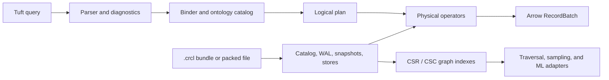

<h1 align="center">CaracalDB</h1>

<p align="center">
  <strong>An Embedded, Ontology-Leaning, Arrow-Native Analytical GraphDB for KG and GNN Workflows.</strong>
</p>

<p align="center">
  <a href="https://pypi.org/project/caracaldb/"></a>
  
  
  
  
</p>

<p align="center">
  <a href="#why-caracaldb">Why CaracalDB</a> |
  <a href="#quickstart">Quickstart</a> |
  <a href="#api-overview">API Overview</a> |
  <a href="#architecture">Architecture</a>
</p>

`CaracalDB` is a Rust-engine embedded graph database for knowledge graphs, ontology-aware query planning, GNN sampling, and ML feature workflows. The first implementation is exposed through Python so the project can validate the `.crcl` storage format, Tuft query language, planner surface, and user-facing API while the Rust core takes shape.

## Quickstart

### Install

```bash
pip install caracaldb
```

or

```bash
uv add caracaldb
```

For development from a repository checkout:

```bash
uv sync --extra dev
uv run pytest
```

## 30-Second Quickstart

```python
import caracaldb as cdb

with cdb.connect("demo") as db:
    conn = db.cursor()
    table = conn.sql(
        "MATCH (g:Gene) WHERE g.chromosome = '17' RETURN g.symbol LIMIT 5"
    ).arrow()

print(table.to_pylist())
```

The current MVP query path supports a single `MATCH (alias:Class)` node pattern with `WHERE`, `RETURN`, and `LIMIT`. Broader graph patterns, richer binding, and multi-hop query execution are tracked in the milestone docs.

## Start Here

- Language spec: `docs/01_language_spec.md`
- Engine spec: `docs/02_engine_spec.md`
- Modeling case study: `docs/03_user_modeling_case_study.md`
- Implementation plan: `docs/04_caracaldb_implementation.md`
- Work breakdown: `docs/05_wbs.md`
- Error index: `docs/errors/TF-INDEX.md`
- Examples: `examples/`
- Benchmark CI: `.github/workflows/bench.yml`

## Why CaracalDB

CaracalDB is built around explicit storage, ontology, and execution boundaries:



- Embedded-first operation: no required server process.
- Tuft combines Cypher-like graph patterns with SPARQL-like ontology semantics.
- Arrow is the execution boundary for scan results and downstream analytics.
- CSR and CSC graph layouts support traversal, neighbor sampling, and GNN workflows.
- Snapshot, WAL, and packed `.crcl` storage paths are tested as first-class engine pieces.
- The Python API is intentionally small and stable over the Rust engine boundary.

## Benchmarks

Benchmark automation is scaffolded in the repository:

- CI automation: `.github/workflows/bench.yml`
- Benchmark harness tests: `tests/test_bench_pkg/`

The CLI exposes a benchmark command for registered scenarios:

```bash
caracal bench NAME
```

## CLI

The CLI is available as `caracal`:

```bash
# Initialise an empty .crcl bundle
caracal init demo

# Run a Tuft query from a file
caracal run demo.crcl --file query.tuft

# Print an explain tree
caracal explain demo.crcl Gene

# Pack and unpack .crcl storage
caracal pack demo.crcl -o demo-packed.crcl
caracal unpack demo-packed.crcl -o restored.crcl
```

## API Overview

### Top-level functions and types

| API | Description |
|---|---|
| `cdb.connect(path, mode="rw", format="auto")` | Open or create a `.crcl` database |
| `Database.cursor()` | Create a query connection |
| `Database.catalog` | Access the ontology catalog |
| `Database.bundle` | Access the underlying storage bundle |
| `Database.open_node_store(class_iri)` | Open a node store for a class |
| `Connection.sql(text, params=None)` | Execute supported Tuft query text |
| `Result.arrow()` | Return a `pyarrow.Table` |
| `Result.record_batches()` | Iterate `pyarrow.RecordBatch` results |

### CLI commands

| Command | Description |
|---|---|
| `caracal init PATH` | Initialise an empty `.crcl` bundle |
| `caracal run BUNDLE --file QUERY` | Execute a Tuft query and emit JSON |
| `caracal explain BUNDLE QUERY` | Print a logical explain tree |
| `caracal bench NAME` | Run a registered microbenchmark |
| `caracal pack BUNDLE -o FILE` | Package a directory bundle into a packed `.crcl` file |
| `caracal unpack FILE -o DIR` | Restore a packed `.crcl` file into a bundle |

## Architecture

CaracalDB is organized as a Python package with focused modules for language, planning, execution, storage, graph layout, ontology, and ML interop:

```text
caracaldb/
  api.py                 Public connect / Database / Connection / Result API
  cli/                   Typer command-line interface
  lang/tuft/             Tuft parser, AST, binder, transformer, typing
  plan/                  Logical plan nodes, rules, cost model, pattern compiler
  exec/                  Physical operators and execution context
  storage/               .crcl bundle, WAL, snapshots, pack/unpack, stores
  graph/                 CSR / CSC builders, readers, HNSW support
  onto/                  Catalog, hierarchy, closure, reasoner
  ingest/                Parquet ingestion helpers
  ml/                    Subgraph, neighbor loader, framework adapters
  observability/         Explain, profile, and tracing helpers
  udf/                   Python and Tuft UDF registry
```

### Execution Pipeline

```text
Tuft text
    |
    v
Parser -> Binder -> Logical plan -> Physical pipeline
                                      |
                                      v
NodeScan / Filter / Project / Expand / Join / Aggregate operators
                                      |
                                      v
Arrow RecordBatch -> pyarrow.Table
```

### Storage Pipeline

```text
.crcl path
    |
    +-- packed single file
    |       |
    |       v
    |   temporary working bundle -> repacked on close
    |
    +-- directory bundle
            |
            v
    manifest / catalog / WAL / snapshots / node stores / edge stores / indexes
```

## Repository Layout

```text
caracaldb/   Python package source
tests/       Unit, golden, property, and end-to-end tests
schema/      FlatBuffers and storage/catalog schemas
docs/        Design documents and user documentation
examples/    Runnable examples and case-study notebooks
```

## Project Status

CaracalDB is pre-release and not yet suitable for production use. The current milestone line is documented in `docs/05_wbs.md`; M0 has been accepted in `docs/milestones/M0-gate.md`, and the repository is now focused on expanding the M1 vertical slice.

## Contributing

Start with `docs/04_caracaldb_implementation.md` and `docs/05_wbs.md`. The core project constraints are:

1. Keep the engine embedded-first.
2. Preserve Arrow-native execution boundaries.
3. Treat Tuft diagnostics and golden parser tests as public contract.
4. Keep `.crcl` storage reproducible through WAL, snapshots, and pack/unpack tests.
5. Measure performance changes before claiming speedups.

## License

Apache License 2.0. See `LICENSE`.
