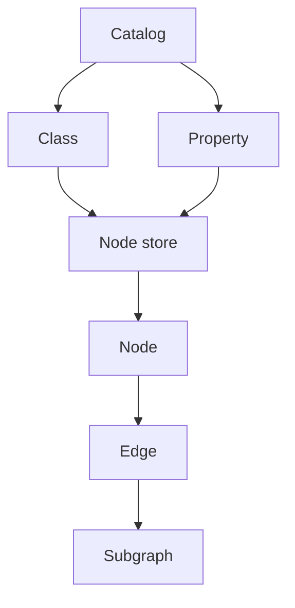

# Data Model

CaracalDB models graph data as typed records inside a bundle. Classes describe node kinds, properties become columns, edges connect node identities, and subgraphs move selected graph slices into query or ML workflows.

## Mental Model


## Core Terms

| Term | Meaning |
|---|---|
| Class | A named node kind, ideally backed by a stable IRI. |
| Property | A typed field stored as an Arrow-compatible column. |
| Node | A row in a class-specific node store. |
| Edge | A directed relationship between source and destination nodes. |
| Subgraph | A selected set of nodes and edges exported for query, analytics, or ML. |

## Code Shape

```python
from caracaldb.onto.catalog import Catalog

catalog = Catalog.empty()
catalog.register_class(iri="http://example.org/Gene", local_name="Gene")
```
The local name keeps Tuft readable. The IRI keeps the model stable when datasets, namespaces, or external ontologies grow.

!!! note "Common misconception"
    A class is not just a display label. Treat it as part of the contract between stored data, Tuft binding, and downstream tools.
