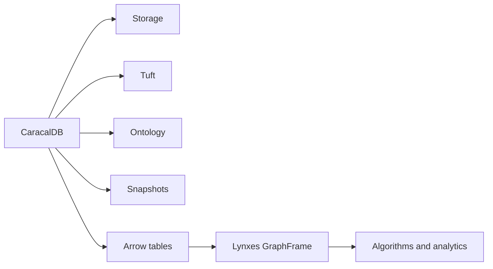

# Lynxes And GraphFrame

CaracalDB and Lynxes are complementary. CaracalDB is the embedded graph database layer. Lynxes is the lazy graph analytics layer.

## Mental Model

## Responsibility Split

| Question | Use CaracalDB | Use Lynxes |
|---|---|---|
| Where is the graph stored? | Yes | No |
| How are ontology names managed? | Yes | No |
| How do I run PageRank or connected components? | Export graph slice | Yes |
| How do I preserve snapshot identity? | Yes | Consume metadata |
| How do I keep result columns Arrow-native? | Yes | Yes |

## Workflow

1. Store and query data in CaracalDB.
2. Export a graph slice as Arrow node and edge tables.
3. Build a Lynxes GraphFrame.
4. Run analytics.
5. Write scores or labels back to CaracalDB when they become graph features.

## Related Pages

Use [Lynxes GraphFrame](../interop/lynxes-graphframe.md) for adapter details and [ML Integration](ml-integration.md) for framework handoff shape.
