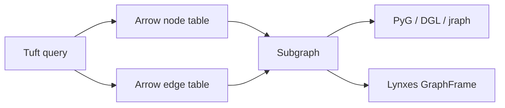

# ML Integration

CaracalDB treats ML integration as an Arrow-first handoff. The database should select, reason over, and snapshot graph data; ML tools should receive compact node and edge tables with stable identifiers.

## Mental Model


## Subgraph Contract

| Part | Shape |
|---|---|
| Nodes | `nodes[class_iri] -> pyarrow.Table` with at least `nid` |
| Edges | `edges[property_iri] -> pyarrow.Table` with `src` and `dst` |
| Metadata | `meta[str] -> str` for snapshot id, seed set, or export notes |

## Code Shape

```python
import pyarrow as pa
from caracaldb.ml.subgraph import Subgraph

sg = Subgraph()
sg.add_nodes("http://example.org/Gene", pa.table({"nid": [1], "symbol": ["TP53"]}))
```
## Why This Shape

Arrow tables keep feature columns and graph identities in one place. That makes the conversion boundary explicit and avoids baking one ML framework into the storage layer.

!!! note "Common misconception"
    CaracalDB does not need to become a training framework. Its job is to produce reproducible graph slices that training frameworks can consume.
