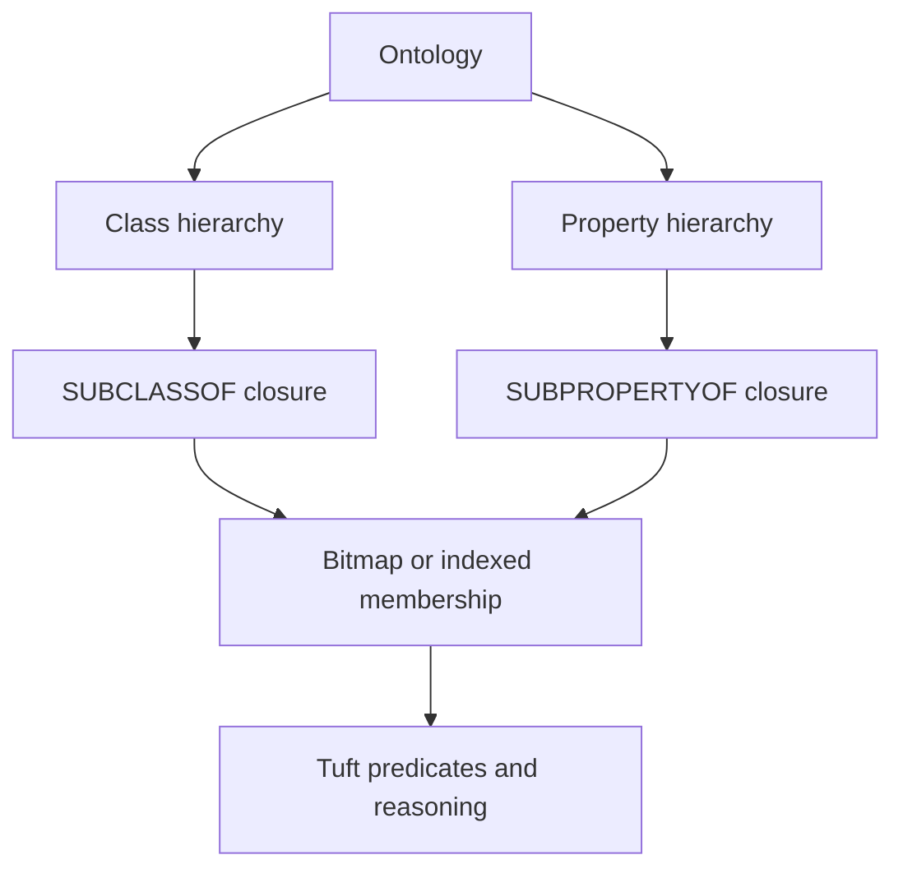

# Ontology

CaracalDB uses ontology metadata to keep graph names meaningful. Classes and properties are not just labels; they can participate in hierarchy, domain, range, and closure rules that make query behavior more predictable across datasets.

## Support Level

| Surface | Status in v0.2.x |
|---|---|
| Class registration with local names | Executable |
| Class IRIs and superclass metadata | Executable |
| `alias.class SUBCLASSOF* <IRI>` | Executable in the focused query path |
| Property closure | Experimental |
| `INFER CLOSURE` materialization | Parsed utility syntax, not a stable execution surface |

## Mental Model


## Core Ideas

| Concept | Meaning |
|---|---|
| Ontology | A named model that groups class and property definitions. |
| Class hierarchy | Parent/child relationships between node classes. |
| Property hierarchy | Parent/child relationships between edge or datatype properties. |
| Closure | The transitive result of hierarchy rules. |
| Domain | Which class a property can start from. |
| Range | Which class or datatype a property can point to. |

## Catalog Shape

For executable v0.1.x code, define classes through the database handle:

```python
import caracaldb as cdb

with cdb.connect("ontology-demo") as db:
    db.define_class("Gene", iri="http://example.org/Gene")
    db.define_class(
        "ProteinCodingGene",
        iri="http://example.org/ProteinCodingGene",
        superclass_iris=("http://example.org/Gene",),
    )
```

The lower-level catalog stores the hierarchy metadata that closure-aware reads consume:

```python
from caracaldb.onto.catalog import Catalog

catalog = Catalog.empty()
catalog.register_class(iri="http://example.org/Gene", local_name="Gene")
catalog.register_class(
    iri="http://example.org/ProteinCodingGene",
    local_name="ProteinCodingGene",
    superclass_iris=("http://example.org/Gene",),
)
```
The superclass link is data, not prose. That lets documentation, validation, query binding, and closure indexes read from the same model.

## Query Shape

Tuft supports the focused class hierarchy predicate in the current MVP query path:

```tuft
MATCH (g:ProteinCodingGene)
WHERE g.class SUBCLASSOF* <http://example.org/Gene>
RETURN g.symbol
```
The `*` means transitive closure: direct subclasses and indirect subclasses can both match the requested superclass.

!!! note "Common misconception"
    Ontology support is not the same thing as importing every OWL feature. CaracalDB focuses on the subset that can be made explicit, testable, and useful for graph queries and ML pipelines.
