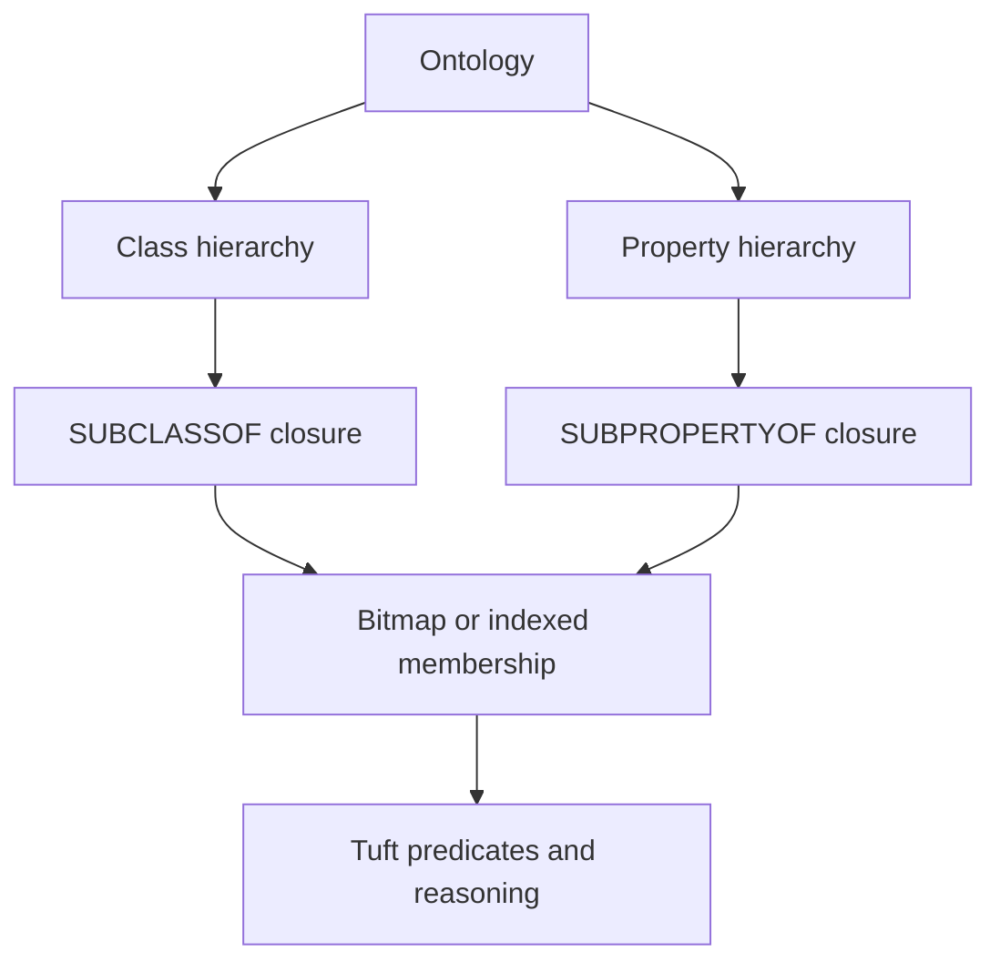

# Ontology

CaracalDB uses ontology metadata to keep graph names meaningful. Classes and properties are not just labels; they can participate in hierarchy, domain, range, and closure rules that make query behavior more predictable across datasets.

## Mental Model


## Core Ideas

| Concept | Meaning |
|---|---|
| Ontology | A named model that groups class and property definitions. |
| Class hierarchy | Parent/child relationships between node classes. |
| Property hierarchy | Parent/child relationships between edge or datatype properties. |
| Closure | The transitive result of hierarchy rules. |
| Domain | Which class a property can start from. |
| Range | Which class or datatype a property can point to. |

## Catalog Shape

```python
from caracaldb.onto.catalog import Catalog

catalog = Catalog.empty()
catalog.register_class(
    iri="http://example.org/ProteinCodingGene",
    local_name="ProteinCodingGene",
    superclass_iris=("http://example.org/Gene",),
)
```
The superclass link is data, not prose. That lets documentation, validation, query binding, and future closure indexes read from the same model.

## Query Shape

Tuft reserves hierarchy predicates for ontology-aware reads:

```tuft
MATCH (g:ProteinCodingGene)
WHERE g.class SUBCLASSOF* <http://example.org/Gene>
RETURN g.symbol
```
The `*` means transitive closure: direct subclasses and indirect subclasses should both match once closure execution is available.

!!! note "Common misconception"
    Ontology support is not the same thing as importing every OWL feature. CaracalDB focuses on the subset that can be made explicit, testable, and useful for graph queries and ML pipelines.
