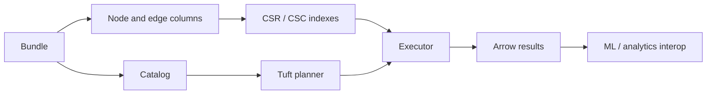

# Architecture Overview

CaracalDB is organized around a storage-first graph database core: durable Arrow-oriented data, ontology-aware query planning, snapshot isolation, and explicit export boundaries for analytic systems.

Concept pages explain why CaracalDB is shaped the way it is. They are for readers who need mental models before choosing an API or query pattern.

## Mental Model


## Code

```python
import caracaldb as cdb

print(cdb.__version__)
```
## Common Misunderstanding

CaracalDB is not a thin wrapper around a dataframe library. Dataframe and graph-compute tools are integration targets; CaracalDB keeps ownership of storage, query semantics, ontology closure, and snapshot boundaries.

## Concept Map

- [Data model](data-model.md): classes, properties, nodes, edges, and subgraphs.
- [Ontology](ontology.md): hierarchy, closure, and reasoning boundaries.
- [Tuft compared with Cypher and SPARQL](tuft-vs-cypher-vs-sparql.md).
- [Storage layout](storage-layout.md): `.crcl`, column chunks, WAL, snapshots, and graph indexes.
- [Snapshots and MVCC](snapshots-and-mvcc.md).
- [ML integration](ml-integration.md): subgraph IR, neighbor loading, and framework adapters.
- [CaracalDB and Lynxes](lynxes-and-graphframe.md): storage/query/reasoning versus lazy graph analytics.
