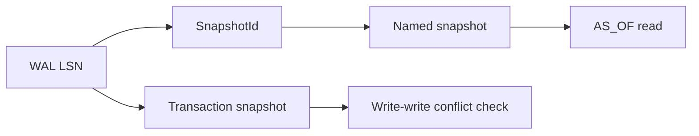

# Snapshots And MVCC

Snapshots give names to stable read views. MVCC gives the engine a way to decide which writes are visible to a reader and when a writer conflicts with another writer.

## Mental Model


## Core Terms

| Term | Meaning |
|---|---|
| LSN | Log sequence number used to order writes. |
| Snapshot | A read view pinned at an LSN. |
| Named snapshot | A durable snapshot entry in the bundle snapshot registry. |
| `AS_OF` | Tuft syntax for binding a read to a snapshot. |
| Write-write conflict | A commit rejection when another writer changed the same key after your snapshot. |

## Support Level

| Surface | Status in v0.2.x |
|---|---|
| WAL-ordered transaction commits | Executable |
| Write-write conflict detection | Executable |
| Named snapshot metadata | Executable |
| Tuft `AS_OF SNAPSHOT` syntax | Executable in the focused query path |

## Storage Shape

Named snapshots are recorded under the bundle's `snapshots/` area and mirrored in the `MANIFEST.snapshots` list. The transaction manager records begin, commit, and rollback events in the WAL.

## Query Shape

```python
import caracaldb as cdb
from pathlib import Path
from tempfile import TemporaryDirectory

with TemporaryDirectory() as tmp:
    path = Path(tmp) / "snapshots.crcl"
    with cdb.connect(path) as db:
        db.define_class("Gene")
        db.insert_nodes("Gene", [{"symbol": "TP53"}])
        snap = db.create_snapshot("release-2026-04")

        db.insert_nodes("Gene", [{"symbol": "BRCA1"}])

        rows = db.sql("""
        MATCH (g:Gene) AS_OF SNAPSHOT 'release-2026-04'
        RETURN g.symbol
        """).rows()
        print(snap.name, snap.lsn_high)
        print(rows)
```

Expected output:

```text
release-2026-04 1
[{'symbol': 'TP53'}]
```

The `AS_OF SNAPSHOT` query reads the pinned view, so the later `BRCA1` insert is not visible.

!!! note "Common misconception"
    A snapshot is not a copy of the whole database. It is a named read boundary, so the engine can decide which versions are visible.
