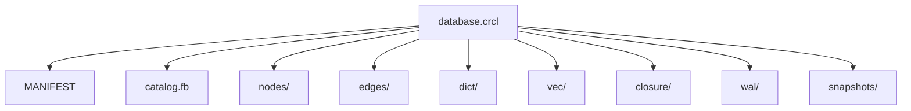

# Storage Layout

CaracalDB stores data in `.crcl` bundles. A bundle can be a directory during development and engine work, or a packed single `.crcl` file through the public connection API.

## Mental Model


## Bundle Directories

| Path | Purpose |
|---|---|
| `MANIFEST` | Bundle metadata, format version, LSNs, snapshots, and tracked files. |
| `catalog.fb` | Catalog payload for classes, properties, graphs, indexes, and ontology metadata. |
| `nodes/` | Class-specific node stores. |
| `edges/` | Edge stores and relationship data. |
| `dict/` | Dictionary or interned value storage. |
| `vec/` | Vector index and embedding-adjacent data. |
| `closure/` | Materialized ontology closure structures. |
| `wal/` | Write-ahead log files. |
| `snapshots/` | Snapshot metadata and retained read views. |

## Directory vs Packed File

`format="bundle"` opens a directory bundle directly. The default `connect()` call can create or open a packed `.crcl` file, unpack it into a working bundle, and repack it on close.

```python
import caracaldb as cdb
from pathlib import Path

path = Path("examples/data/example_simple.crcl")
with cdb.connect(path, mode="ro") as db:
    print(db.bundle.path.name)
```

Expected output:

```text
example_simple.crcl
```
!!! note "Common misconception"
    The `.crcl` suffix does not always mean the same physical shape. Check whether a path is a directory bundle or a packed file before writing tooling that inspects it directly.
