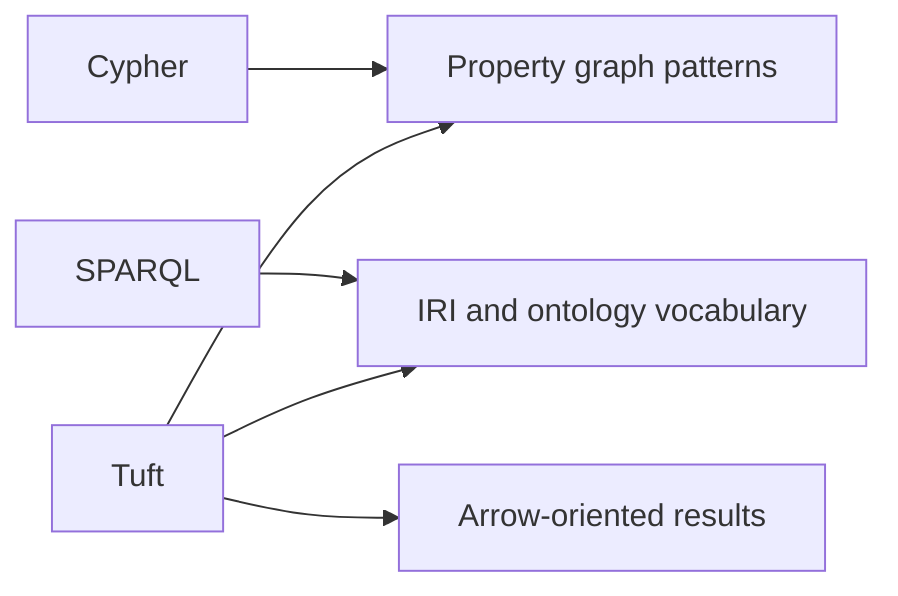

# Tuft vs Cypher vs SPARQL

Tuft borrows familiar graph-query shapes but is not trying to be a clone of Cypher or SPARQL. It is CaracalDB's language for graph records, ontology-aware names, and Arrow-friendly embedded workflows.

## Mental Model


## Comparison

| Topic | Tuft | Cypher | SPARQL |
|---|---|---|---|
| Main data model | CaracalDB graph bundle | Property graph | RDF triples |
| Names | Local names plus IRIs | Labels and relationship types | IRIs and prefixes |
| Query entry point | `MATCH` | `MATCH` | `SELECT` / `CONSTRUCT` |
| Ontology hook | `SUBCLASSOF*`, `INFER CLOSURE` | Usually external or APOC-style | Native RDF/OWL ecosystem |
| Result shape | Arrow table | Driver records | RDF bindings |
| Embedded Python workflow | Primary target | Usually remote server | Usually endpoint or library |

## Similar Query Shape

Cypher:

```cypher
MATCH (g:Gene)
WHERE g.chromosome = '17'
RETURN g.symbol
LIMIT 5
```
Tuft:

```tuft
MATCH (g:Gene)
WHERE g.chromosome = '17'
RETURN g.symbol
LIMIT 5
```
SPARQL:

```sparql
PREFIX bio: <http://example.org/>
SELECT ?symbol WHERE {
  ?g a bio:Gene ;
     bio:chromosome "17" ;
     bio:symbol ?symbol .
}
LIMIT 5
```
## When To Think In Each Language

Use Cypher intuition for pattern matching. Use SPARQL intuition for stable IRIs, prefixes, and ontology vocabulary. Use Tuft when the graph lives in CaracalDB and the result should flow into Python, Arrow, analytics, or ML.

!!! note "Common misconception"
    A query that looks like Cypher is not automatically Cypher-compatible. Tuft keeps familiar syntax where it helps, but its compatibility contract is the Tuft reference and specification.
