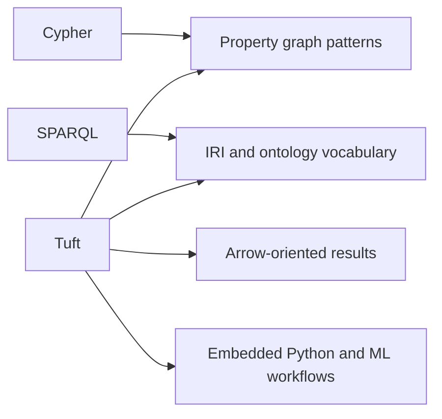

# Tuft vs Cypher vs SPARQL

Tuft borrows familiar graph-query shapes, but it is not trying to be a clone of Cypher or SPARQL. It is CaracalDB's language for graph records, ontology-aware names, and Arrow-friendly embedded workflows.

The point is not that Tuft has a prettier spelling for the same ideas. The point is that CaracalDB needs one query contract that can read like a property-graph query, keep ontology identity explicit, and return columnar results without crossing a server or RDF endpoint boundary.

## Why Tuft Exists

Cypher is excellent when the graph is a property graph and the main job is to describe paths. SPARQL is excellent when the graph is RDF and the main job is to preserve web-scale IRI semantics. CaracalDB sits between those worlds: users often want property-graph ergonomics, ontology-backed class names, and direct Arrow/Python handoff in the same embedded database.

Tuft is CaracalDB's answer to that middle ground:

| Need | Why Cypher alone is awkward | Why SPARQL alone is awkward | What Tuft chooses |
|---|---|---|---|
| Readable graph patterns | Strong fit | Triple patterns get verbose for local graph traversals | Keep Cypher-like `MATCH (n:Class)` patterns |
| Durable ontology names | Labels are usually local database vocabulary | Strong fit | Keep IRIs, prefixes, and hierarchy predicates |
| Embedded analytics | Often driver/server shaped | Often endpoint/binding shaped | Return Arrow-shaped tables in-process |
| ML handoff | Usually an integration layer | Usually a conversion layer | Treat query output as columnar data ready for Python/ML |
| Controlled reasoning | Usually external or plugin-specific | Rich, but broad and sometimes implicit | Make supported closure rules explicit and testable |

## Mental Model



## Comparison

| Topic | Tuft | Cypher | SPARQL |
|---|---|---|---|
| Main data model | Ontology graph | Property graph | RDF triples |
| Names | Local names backed by IRIs | Labels and relationship types | IRIs and prefixes |
| Query entry point | `MATCH` | `MATCH` | `SELECT` / `CONSTRUCT` |
| Ontology hook | `SUBCLASSOF*`, `INFER CLOSURE` | Usually external or APOC-style | Native RDF/OWL ecosystem |
| Result shape | Arrow table or Python rows | Driver records | RDF bindings |
| Embedded Python workflow | Primary target | Usually remote server | Usually endpoint or library |

Here, ontology graph means CaracalDB's graph model: nodes and edges are queried like a property graph, while classes and properties can also carry stable IRIs and hierarchy metadata.

This table can make the languages look like a menu of equivalent names. They are not equivalent in CaracalDB. The important difference is where each concept lives:

- In Cypher, `Gene` is normally a graph label.
- In SPARQL, `bio:Gene` is normally an RDF class IRI.
- In Tuft, `Gene` is a query-friendly class name backed by catalog metadata, so it can stay readable while still pointing at a stable IRI.

## Similar Surface, Different Contract

Cypher:

```cypher
MATCH (g:Gene)
WHERE g.chromosome = '17'
RETURN g.symbol
LIMIT 5
```

Tuft:

```tuft
MATCH (g:Gene)
WHERE g.chromosome = '17'
RETURN g.symbol
LIMIT 5
```

That similarity is intentional. The user should not have to write triple boilerplate for a simple node scan.

The difference appears when ontology identity matters. In Tuft, the readable class label can still participate in hierarchy-aware queries:

```tuft
MATCH (g:ProteinCodingGene)
WHERE g.class SUBCLASSOF* <http://example.org/Gene>
RETURN g.symbol
```

In Cypher, this usually becomes an application convention, an extra label strategy, or plugin-specific logic. In SPARQL, the same idea is natural, but the rest of the query is triple-shaped:

```sparql
PREFIX bio: <http://example.org/>
SELECT ?symbol WHERE {
  ?g a/rdfs:subClassOf* bio:Gene ;
     bio:symbol ?symbol .
}
```

Tuft is trying to keep the first query's local readability and the second query's stable ontology identity.

For the plain node-filter case, the equivalent SPARQL query is already more structural:

```sparql
PREFIX bio: <http://example.org/>
SELECT ?symbol WHERE {
  ?g a bio:Gene ;
     bio:chromosome "17" ;
     bio:symbol ?symbol .
}
LIMIT 5
```

## Terminology

The naming is deliberately hybrid, but the terms are not meant to hide that heritage.

| Tuft term | Closest Cypher term | Closest SPARQL/RDF term | Why CaracalDB uses it |
|---|---|---|---|
| Class | Label | RDF class | A query label that can also have an IRI and superclass links |
| Property | Property / relationship type | Predicate | One catalog concept for typed fields and graph relationships |
| IRI | Usually external metadata | IRI | Durable identity for classes and properties |
| Closure | Usually plugin or app logic | Transitive path / entailment | Explicit, bounded hierarchy expansion |
| Arrow table | Driver result table | Binding table | Columnar result shape for embedded analytics |

## When Tuft Is Better

Use Tuft when the graph lives in CaracalDB and you need more than one of these at the same time:

- Cypher-like pattern readability for local graph records.
- SPARQL-like durable identity through IRIs and prefixes.
- Explicit ontology closure such as `SUBCLASSOF*`.
- In-process results that become Arrow tables or Python rows.
- A path from graph query to analytics, feature extraction, or ML without a separate translation layer.

Use Cypher when you are primarily targeting a property-graph server and its ecosystem. Use SPARQL when you are primarily working with RDF datasets, federation, or standards-heavy semantic-web tooling. Tuft is best when CaracalDB is the execution engine and the query should stay close to both ontology metadata and columnar computation.

!!! note "Common misconception"
    A query that looks like Cypher is not automatically Cypher-compatible. Tuft keeps familiar syntax where it helps, but its compatibility contract is the Tuft reference and specification.
