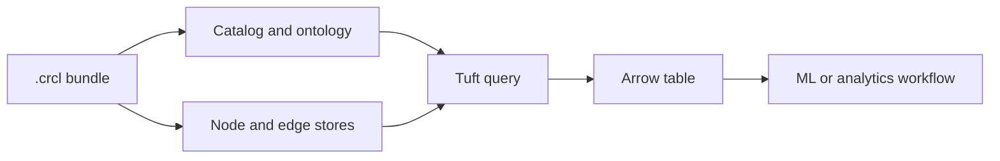

# Why CaracalDB

CaracalDB is for teams that need a graph-shaped working set, ontology-aware names, and Arrow-friendly results without turning every workload into a remote database service. It starts from the assumption that graph data is often part of an ML or analytics pipeline, not a separate universe.

## Positioning

| Compared with | CaracalDB emphasizes | Tradeoff |
|---|---|---|
| General embedded stores | Graph classes, edges, Tuft, and Arrow result flow | Narrower than a general key-value or SQL engine |
| Neo4j | Local-first packaging, IRI-aware modeling, Arrow interchange | Not full Cypher or APOC compatibility |
| DuckDB | Graph patterns and ontology semantics | Not a relational analytics replacement |
| NetworkX-style scripts | Durable graph bundles and query surfaces | Less flexible than ad hoc Python objects |

## Mental Model


## A Small Example

```tuft
MATCH (g:Gene)
WHERE g.chromosome = '17'
RETURN g.symbol
LIMIT 5
```
This is the core promise of v0.1.x: keep the graph model explicit, run a focused Tuft query, and hand the result to Arrow-compatible Python code.

!!! note "Common misconception"
    CaracalDB is not positioned as “Python instead of Rust.” The public package is Python-facing today, while the engine roadmap keeps the Rust implementation path explicit.
